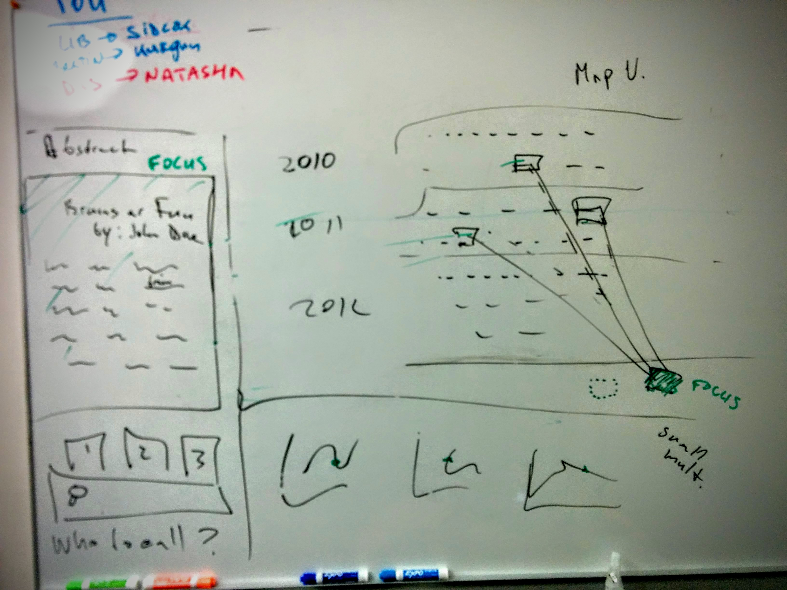

# `science-surveyor` design spec

Science Surveyor is an interactive visualization designed to help science
journalists find contextual information relevant to new research they are reporting on.

The graphic contains three sections:

1. Abstract section
2. Map section
3. Small multiples sections

## 1. Abstract view: text-based information

The abstract view will be a place to load the currently focused abstract.
Key words within the text will be highlighted and brought to the foreground in
the map view. Eventually a search box can live here to enable browsing through
abstracts given a connection to a database. At version one of the project we
will concentrate on several "canned" studies. For the demo we can fake the
search box.

The Who to Call text can live here as part of the same graphic or as a
separate pop-up view.

## 2. Map view: nuanced narrative

The map view will consist of a timeline grid made up of tiles, with each tile
representing a paper. Selecting a paper will highlight related papers in the
field based on citation and/or language similarity. The map view rearranges
itself in response to the other elements of the visualisation. For example,
selecting different small multiples results in a rearrangement of the grid.

## 3. Small multiples view: "at a glance" information

The small multiples view presents time series data, reflecting overall trends
in the corpus. The paper focused in the abstract view should also be located
on the small multiples curve. Clicking on each of the small multiples can have
an effect on the map view.

